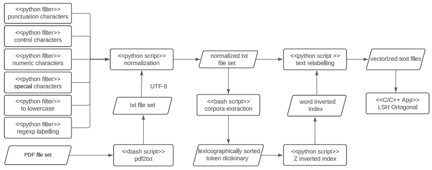

# Nearest neighbor search (NNS) : Locality Sensitive Hashing

In 1999 Gionis et. al $^1$ addressed the Nearest Neighbors Search (NNS) problem as a mapping problem in associative memory (Locality Sensitive Hashing LSH). Although a formal proof establishing an equivalence between both classes of problems was not given, they showed that the allocation and search operators maintain similarity/dissimilarity properties between objects given two probabilities. Their contribution was founded on the following reasoning <i>"similar objects in Euclidean space are be placed in the same location in associative memory with high probability, whereas dissimilar objects are placed in the same location in associative memory with low probability."</i> Formally, stated as:

Let H = {h: S → U} be a family of hash functions $h$, such that given any two vectors $v, q \in S$ the following holds:

1. if $v \in B \left ( q, r_1 \right )$ then $Pr_H \left [ h\left ( q \right ) = h\left ( v \right ) \right ] \geq p_1$
2. if $v \notin B \left ( q, r_2 \right )$ then $Pr_H \left [ h\left ( q \right ) = h\left ( v \right ) \right ] \leq p_2$

With $r_1, r_2, c \in \mathbb{R}^{+}, c \neq 0, r_2 = c r_1$, $p_1$ and $p_2$ probabilities with $p_2 < p_1$, and $B$ a balls of radius $r_1$ and $r_2$. Note $S \subset \mathbb{R}^{d}$.

This repository contains a C/C++ implementation of the orthogonal LSH heuristic. The heuristic input is an integer-encoded sequence of words, an integer-encoded text file, and an inverse dictionary. The sequence size is nine words maximum. Zero passing is added if the query size is less than nine words. The repository also includes several bash and python scripts that facilitate data preprocessing phases.

The repository also include a series of bash and python scripts that facilitate the data pre-processing process. The workflow starts by transforming PDF files to UTF-8 text files via the pdf2txt script. You might need to install [pdftotext]( https://www.xpdfreader.com/pdftotext-man.html) utilities first. In the normalization phase, multiples filters can be selectively applied.  The corpora extraction phase retrieve unique strings and sorts them in lexicographical order. Each string is assigned a unique integer label in the Z_inverted index phase. The normalized text files are later relabeled using the inverted index in the relabeling phase. Finally, the vectored text files can be used by LSH to perform a query. Note, the query must also be relabeled using the inverted index.  

<small>
$^1$ Gionis, A., Indyk, P. and Motwani, R. <i>Similarity Search in High Dimensions via Hashing</i>. Proceedings of the 25th International Conference on Very Large Data Bases (San Francisco, CA, USA, 1999), 518–529. <b>1999</b>.
</small>

